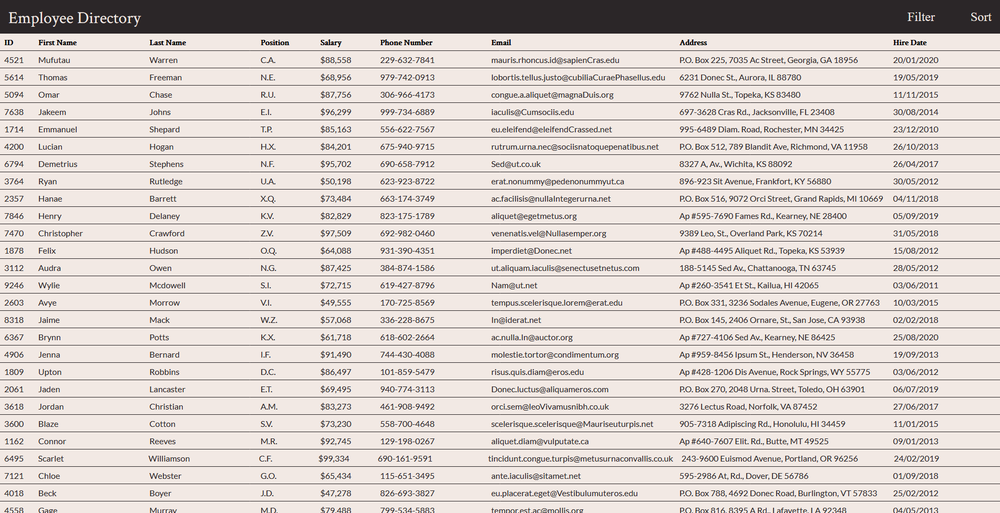
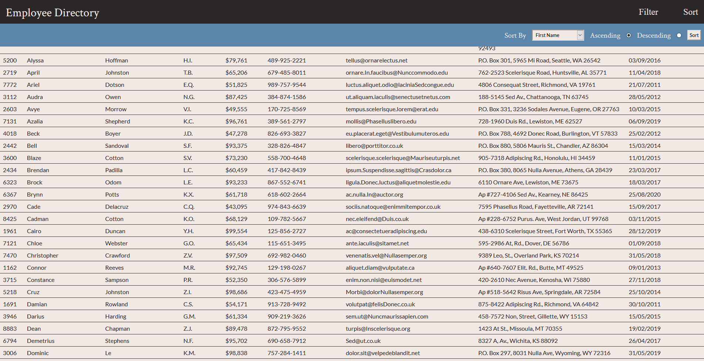

# Employee Directory

[View Employee Directory]()

## Description

The Employee Directory allows users to view a table of important information about their employees. They are given options to filter and sort employees by given categories.

## Table of Contents

* [Installation](#Installation)
* [Usage](#Usage)
* [Technologies](#Technologies)
* [License](#License)
* [Contribution](#Contribution)
* [Tests](#Tests)
* [Contact](#Contact)

## Installation

Clone from github repo. Navigate to root directory and run npm install. Use npm start to launch the application.

    npm start

## Usage

From the main screen you will see a list of all available employees. In the navigation bar, click on either _Filter_ or _Sort_ to access their respective toolbars.

Filter options allows the user to select a category and enter a value to filter by. Choose a category from the dropdown and enter a value. Click the filter button, and the application will show only employees that match the value for the selected category.

Sort options allows the user to sort all employees by their selected category. Choose a category from the dropdown and choose either the _ascending_ or _descending_ options. Click sort, and the application will sort all employees by the selected category.

## Technologies

* HTML
* CSS
* Javascript
* React

## License

Employee Directory is licensed under the [MIT](https://opensource.org/licenses/MIT) license.

## Contribution

N/A

## Tests

N/A

## Contact

Reach out to me at the following

* Github: [https://github.com/nbur4556](https://github.com/nbur4556)
* Email: nbur4556@gmail.com